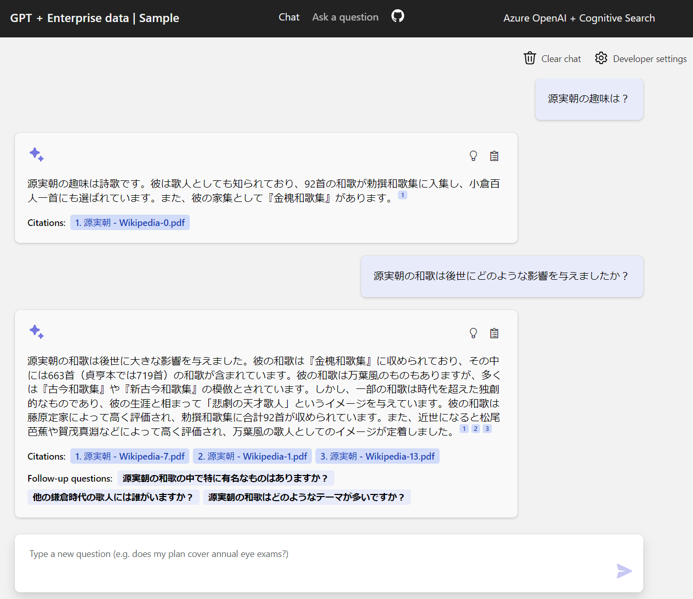
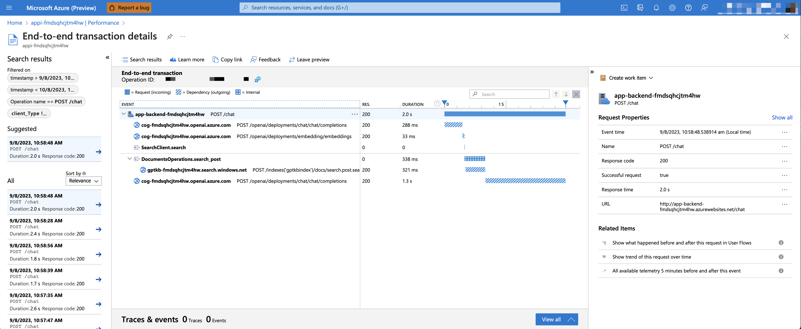

# ChatGPT + Enterprise data with Azure OpenAI and Cognitive Search

## Table of Contents

- [機能](#機能)
- [はじめに](#はじめに)
- [Azure へのデプロイ](#azure-へのデプロイ)
  - [コスト見積もり](#コスト見積もり)
  - [前提条件](#前提条件)
    - [ローカルで実行する場合](#ローカルで実行する場合)
  - [新規でデプロイする](#新規でデプロイする)
  - [既存のリソースでのデプロイ](#既存のリソースでのデプロイ)
  - [再デプロイ](#再デプロイ)
- [環境の共有](#環境の共有)
- [ローカルで実行](#ローカルで実行)
- [Web アプリの使用](#Web-アプリの使用)
- [オプション機能の有効化](#オプション機能の有効化)
  - [Application Insights の有効化](#application-insights-の有効化)
  - [認証の有効化](#認証の有効化)
- [GitHub Codespaces または VS Code Remote Containers で実行する場合](#github-codespaces-または-vs-code-remote-containers-で実行する場合)
- [Resources](#resources)
  - [FAQ](#faq)
  - [トラブルシューティング](#トラブルシューティング)

[](https://github.com/codespaces/new?hide_repo_select=true&ref=main&repo=599293758&machine=standardLinux32gb&devcontainer_path=.devcontainer%2Fdevcontainer.json&location=WestUs2)
[](https://vscode.dev/redirect?url=vscode://ms-vscode-remote.remote-containers/cloneInVolume?url=https://github.com/azure-samples/azure-search-openai-demo)

このサンプルでは、Retrieval Augmented Generation パターンを使用して、独自のデータに対してChatGPT のような体験を作成するためのいくつかのアプローチを示しています。ChatGPT モデル（gpt-35-turbo）にアクセスするために Azure OpenAI Service を使用し、データのインデックス作成と検索に Azure Cognitive Search を使用しています。

レポジトリにはサンプルデータが含まれているので、すぐに End-to-End で試すことができます。このサンプルアプリケーションでは、日本の鎌倉時代の武将に関する Wikipedia データが含まれており、鎌倉幕府や武将について質問できるような体験ができます。


## 機能

* チャットと Q&A インターフェース
* 引用、ソースコンテンツの追跡など、ユーザが回答の信頼性を評価するための様々な選択肢を検討する。
* データ準備、プロンプト作成、モデル（ChatGPT）と Retriever(Azure Cognitive Search) 間の連携のための可能なアプローチを示すことができる。
* UX で直接設定することで、動作の調整やオプションの実験が可能です。
* オプション: Application Insights によるパフォーマンストレースとモニタリング



## はじめに

> **重要:** このサンプルをデプロイして実行するには、**Azure OpenAI Service へのアクセスを有効にした** Azure サブスクリプションが必要です。[こちら](https://aka.ms/oaiapply)でアクセスをリクエストできます。また、[こちら](https://azure.microsoft.com/free/cognitive-search/) から開始するための無料の Azure クレジットを取得することもできます。


## Azure へのデプロイ 

### コスト見積もり

価格はリージョンや利用方法によって異なるため、あなたの利用方法に対する正確なコストを予測することはできません。ただし、以下のリソースについては、[Azure 価格計算ツール](https://azure.com/e/8ffbe5b1919c4c72aed89b022294df76) をお試しください。

- Azure App Service: Basic Tier、1CPU コア、1.75GB RAM。1 時間あたりの[価格](https://azure.microsoft.com/pricing/details/app-service/linux/)
- Azure OpenAI: Standard Tier、ChatGPT、Ada モデル。使用された 1K トークンあたりの価格、および 1 問あたり少なくとも 1K トークンが使用されます。[価格](https://azure.microsoft.com/pricing/details/cognitive-services/openai-service/)
- Form Recognizer: S0(Standard) Tier は、あらかじめ構築されたレイアウトを使用します。価格はドキュメント ページあたりの課金です。[価格](https://azure.microsoft.com/pricing/details/form-recognizer/)
- Azure Cognitive Search: Basic Tier, 1 レプリカ、無料レベルのセマンティック検索。1 時間あたりの[価格](https://azure.microsoft.com/pricing/details/search/)
- Azure Blob Storage: Standard Tier LRS（ローカル冗長）。ストレージと読み取り操作ごとの価格。[価格](https://azure.microsoft.com/pricing/details/storage/blobs/)
- Azure Monitor: 従量課金制。費用は、取り込んだデータに基づいて計算されます。[価格](https://azure.microsoft.com/pricing/details/monitor/)

コストを削減するために、`infra` フォルダの下のパラメータファイルを変更することで、Azure App Service、Azure Cognitive Search、Form Recognizer の無料 SKU に切り替えることができます。例えば、無料の Cognitive Search リソースは 1 サブスクリプションにつき 1 つまでで、無料の Form Recognizer リソースは各ドキュメントの最初の 2 ページのみを分析します。また、`data` フォルダ内のドキュメント数を減らすか、`prepdocs.py` スクリプトを実行する `azure.yaml` の postprovision フックを削除することで、Form Recognizer に関連するコストを削減することができます。

⚠️ 不要なコストを避けるために、アプリが使われなくなったら、忘れずにアプリを削除してください、ポータルでリソースグループを削除するか、`azd down` を実行してください。

### 前提条件

#### ローカルで実行する場合

* [Azure Developer CLI](https://learn.microsoft.com/azure/developer/azure-developer-cli/install-azd)
* [Python 3.9+](https://www.python.org/downloads/)
  * **重要**: セットアップスクリプトを動作させるには、Windows のパスに Python と pip パッケージマネージャが含まれている必要があります。Python を Microsoft Store 経由でインストールすると、うまく実行できないことがあります。Python 公式サイトからインストーラをダウンロードして、手動でインストールしてください。
  * **重要**: コンソールから `python --version` を実行できることを確認します。Ubuntu では、`python` を `python3` にリンクするために、`sudo apt install python-is-python3` を実行する必要があるかもしれません。
* [Node.js 14+](https://nodejs.org/en/download/)
* [Git](https://git-scm.com/downloads)
* [Powershell 7+ (pwsh)](https://github.com/powershell/powershell) - Windows ユーザーのみ。
  * **重要**: PowerShell コマンドから `pwsh.exe` を実行できることを確認します。失敗した場合は、PowerShell をアップグレードする必要があります。

>NOTE: Azure アカウントには、[User Access Administrator](https://learn.microsoft.com/azure/role-based-access-control/built-in-roles#user-access-administrator) または [Owner](https://learn.microsoft.com/azure/role-based-access-control/built-in-roles#owner) などの `Microsoft.Authorization/roleAssignments/write` 権限が必要です。

### 新規でデプロイする

既存の Azure サービスがなく、新しいデプロイから始めたい場合は、以下のコマンドを実行します。

1. `azd up` を実行する - Azure リソースをプロビジョニングし、`./data` フォルダにあるファイルに基づいて検索インデックスを構築するなど、これらのリソースにこのサンプルをデプロイします。
    * このロケーションリストは [OpenAI モデル利用可能リージョン一覧](https://learn.microsoft.com/azure/cognitive-services/openai/concepts/models#model-summary-table-and-region-availability)に基づいており、可用性が変わると古くなる可能性があります。
1. アプリケーションが正常にデプロイされると、コンソールに URL が表示されます。 その URL をクリックして、ブラウザでアプリケーションを操作してください。

以下のような表示になります。


> NOTE: アプリケーションが完全にデプロイされるまで 1 分ほどかかるかもしれません。"Python Developer" のウェルカムスクリーンが表示されたら、少し待ってからページを更新してください。


## 既存のリソースでのデプロイ
すでに必要なリソースがデプロイ済みの場合、下記の環境変数に値をセットして `azd up` します。
1. Run `azd env set AZURE_OPENAI_SERVICE {既存の OpenAI のサービス名}`
1. Run `azd env set AZURE_OPENAI_RESOURCE_GROUP {OpenAI サービスがプロビジョニングされる既存のリソースグループ名}`
1. Run `azd env set AZURE_OPENAI_CHATGPT_DEPLOYMENT {既存の ChatGPT のデプロイ名}`. ChatGPT モデルのデプロイがデフォルトの 'chat' でない場合にのみ必要です。
1. Run `azd env set AZURE_OPENAI_EMB_DEPLOYMENT {既存の GPT Emeddings デプロイ名}`. embeddings モデルのデプロイがデフォルトの 'embedding' でない場合にのみ必要です。
1. Run `azd up` - これにより、残りの Azure リソースがプロビジョニングされ、`./data` フォルダにあるファイルに基づいて検索インデックスを構築するなど、これらのリソースにこのサンプルがデプロイされます。

> NOTE: 既存の Search Account や Storage Account を利用することもできる。 既存のリソースを設定するために `azd env set` に渡す環境変数のリストについては `./infra/main.parameters.json` を参照してください。

### 再デプロイ

`app` フォルダ内のバックエンド/フロントエンドのコードだけを変更したのであれば、Azure リソースをプロビジョニングし直す必要はない。アプリのみをデプロイするには以下を実行します：

```azd deploy```

インフラファイル（`infra` フォルダまたは `azure.yaml`）を変更した場合は、Azure リソースを再プロビジョニングする必要があります。そのためには以下を実行します。

```azd up```

## 環境の共有

完全にデプロイされた既存の環境に、他の誰かにアクセスさせるには、以下のステップを踏んでください：

1. [Azure CLI](https://learn.microsoft.com/cli/azure/install-azure-cli) をインストールする。
1. `azd init -t azure-search-openai-demo` を実行するか、このリポジトリをクローンする。
1. `azd env refresh -e {environment name}` を実行します。azd 環境名、サブスクリプション ID、ロケーションが必要です。これらの値は `.azure/{env name}/.env` ファイルにあります。 これで azd 環境の `.env` ファイルに、アプリをローカルで実行するために必要なすべての設定が入力されます。
1. `.env` ファイルまたはアクティブ シェルのいずれかで、環境変数 `AZURE_PRINCIPAL_ID` を Azure ID に設定します。これは、`az ad signed-in-user show` で取得できます。
1. `./scripts/roles.ps1` または `.scripts/roles.sh` を実行して、必要なすべてのロールをユーザに割り当てます。そのユーザがサブスクリプションでロールを作成するのに必要な権限を持っていない場合は、そのユーザのためにこのスクリプトを実行する必要があるかもしれません。スクリプトが実行されると、ローカルでアプリを実行できるようになります。


## ローカルで実行

ローカルで実行できるのは、`azd up` コマンドの実行に成功した**後**だけです。

1. `azd auth login` を実行
2. `cd app` で app ディレクトリへ移動
3. `./start.ps1` または `./start.sh` を実行するか、"VS Code Task： Start App "を実行して、プロジェクトをローカルで開始する。

## Web アプリの使用

* Azure 上： azd コマンドによってデプロイされた Azure WebApp に移動する。URL は azd コマンドの完了時に出力される（"Endpoint "として）か、Azure ポータルで見つけることができる。
* ローカルで実行：`http://127.0.0.1:50505` をブラウザで開く

ウェブアプリに入ったら:

* チャットや Q&A でさまざまなトピックを試してみましょう。チャットでは、フォローアップの質問、明確な説明、回答の簡略化や詳細化などを試してみましょう。
* 引用と出典を調べてみましょう
* 「設定」をクリックして、さまざまなオプションを試したり、プロンプトを調整したりできます。


## オプション機能の有効化

### Application Insights の有効化

Application Insights と各リクエストのトレース、エラーのログを有効にするには、 `azd up` を実行する前に `AZURE_USE_APPLICATION_INSIGHTS` 変数を true に設定します。

1. `azd env set AZURE_USE_APPLICATION_INSIGHTS true` を実行
1. `azd up` を実行

パフォーマンスデータを見るには、リソースグループの Application Insights リソースに移動し、"Investigate -> Performance" ブレードをクリックし、タイミングデータを見るために任意の HTTP リクエストに移動します。
チャットリクエストのパフォーマンスを検査するには、"Drill into Samples" ボタンを使用して、任意のチャットリクエストに対して行われたすべての API コールのエンドツーエンドのトレースを確認します：



例外やサーバーエラーを見るには、"Investigate -> Failures "ブレードに移動し、フィルタリングツールを使って特定の例外を探します。右側に Python のスタックトレースが表示されます。

### 認証の有効化

デフォルトでは、デプロイされた Azure Web アプリは認証やアクセス制限が有効になっておらず、Web アプリへのルーティング可能なネットワーク アクセスがあれば、誰でもインデックス化されたデータとチャットできることになります。[Azure App Service で実行されている Web アプリにアプリの認証を追加する](https://learn.microsoft.com/azure/app-service/scenario-secure-app-authentication-app-service)チュートリアルに従って Azure Active Directory への認証を要求し、デプロイされた Web アプリに対してそれを設定することができます。

その後、特定のユーザーまたはグループへのアクセスを制限するには、[Azure AD アプリを Azure AD テナントの一連のユーザーに制限する](https://learn.microsoft.com/azure/active-directory/develop/howto-restrict-your-app-to-a-set-of-users) の手順に従って、Enterprise Application の下の "Assignment Required?" オプションを変更し、ユーザー/グループへのアクセスを割り当てます。 明示的にアクセス権が付与されていないユーザーには、「AADSTS50105: Your administrator has configured the application <app_name> to block users unless they are specifically granted ('assigned') access to the application.」というエラーメッセージが表示されます。

### GitHub Codespaces または VS Code Remote Containers で実行する場合

GitHub Codespaces または VS Code Remote Containers を使えば、このレポジトリを仮想的に実行できます。以下のボタンのいずれかをクリックして、これらのオプションのいずれかでこのレポジトリを開いてください。

[](https://github.com/codespaces/new?hide_repo_select=true&ref=main&repo=599293758&machine=standardLinux32gb&devcontainer_path=.devcontainer%2Fdevcontainer.json&location=WestUs2)
[](https://vscode.dev/redirect?url=vscode://ms-vscode-remote.remote-containers/cloneInVolume?url=https://github.com/azure-samples/azure-search-openai-demo)

## Resources

* [Revolutionize your Enterprise Data with ChatGPT: Next-gen Apps w/ Azure OpenAI and Cognitive Search](https://aka.ms/entgptsearchblog)
* [Azure Cognitive Search](https://learn.microsoft.com/azure/search/search-what-is-azure-search)
* [Azure OpenAI Service](https://learn.microsoft.com/azure/cognitive-services/openai/overview)

### FAQ

<details>
<summary>Azure Cognitive Search は大きな文書の検索をサポートしているのに、なぜ PDF をチャンクに分割する必要があるのでしょうか？</summary>

チャンキングによって、トークンの制限のために OpenAI に送信する情報量を制限することができます。コンテンツを分割することで、OpenAI に注入できる潜在的なテキストのチャンクを簡単に見つけることができます。私たちが使っているチャンキングの方法は、あるチャンクが終わると次のチャンクが始まるように、テキストのスライディングウィンドウを活用します。これにより、テキストのコンテキストが失われる可能性を減らすことができます。

</details>

<details>
<summary>すべてを再デプロイすることなく、追加の PDF をアップロードするにはどうすればよいでしょうか？</summary>

さらに PDF をアップロードするには、それらを `data/` フォルダに入れ、`./scripts/prepdocs.sh` または `./scripts/prepdocs.ps1` を実行します。既存のドキュメントの再アップロードを避けるために、それらを data フォルダの外に移動します。前にアップロードされたものをチェックする機能を実装することもできます。
</details>

<details>
<summary>このサンプルは、他の Chat with Your Data サンプルと比べてどうですか？</summary>

このユースケースで人気のある別のリポジトリはこちら：
https://github.com/Microsoft/sample-app-aoai-chatGPT/

このリポジトリは、Azure OpenAI Studio と Azure Portal を使ってセットアップするために設計されています。また、完全にゼロからデプロイしたい人のための `azd` サポートも含まれています。

主な相違点

* このリポジトリには、（Azure OpenAI と Azure Cognitive Search への）複数の API 呼び出しの結果をさまざまな方法で連鎖させる複数の RAG（検索拡張生成）アプローチが含まれています。もう一つのリポジトリは、ChatCompletions API の組み込みデータソースオプションのみを使用し、指定された Azure Cognitive Search インデックスで RAG アプローチを使用します。これは、ほとんどの用途で動作するはずですが、より柔軟性が必要な場合は、このサンプルの方が良いかもしれません。
* このリポジトリは、他のリポジトリのように Azure OpenAI Studio と結びついていないので、他の点でも少し実験的です。

</details>

<details>
<summary>このサンプルで GPT-4 をどのように使うのですか？</summary>

`infra/main.bicep` の `chatGptModelName` を 'gpt-35-turbo' ではなく 'gpt-4' に変更してください。また、アカウントが許可している TPM の容量に応じて、その行の上の容量を調整する必要があるかもしれません。
</details>


### トラブルシューティング

ここでは、最も一般的な問題のシナリオと解決策を紹介します。

1. サブスクリプション (`AZURE_SUBSCRIPTION_ID`) が Azure OpenAI サービスにアクセスできません。`AZURE_SUBSCRIPTION_ID` が [OpenAI アクセス要求プロセス](https://aka.ms/oai/access) で指定された ID と一致することを確認してください。

1. Azure OpenAI が有効になっていないリージョン（East US ではなく East US 2 など）でリソースを作成しようとしているか、使用しようとしているモデルが有効になっていません。[利用可能モデル一覧](https://aka.ms/oai/models) を参照してください。

1. クオータ（リージョンごとのリソース数）を超えている。クォータと制限に関する[この記事](https://learn.microsoft.com/ja-jp/azure/ai-services/openai/quotas-limits)を参照してください。

1. "同じリソース名は許可されていません "というコンフリクトが発生しています。サンプルを何度も実行し、そのたびに作成したリソースを削除しているにもかかわらず、パージするのを忘れている可能性があります。Azure は、ソフト削除で解放しない限り、リソースを 48 時間保持します。[リソースの解放についてはこちらの記事](https://learn.microsoft.com/azure/cognitive-services/manage-resources?tabs=azure-portal#purge-a-deleted-resource)を参照してください。

1. `prepdocs.py` スクリプトを実行すると、`CERTIFICATE_VERIFY_FAILED` が表示されます。これは通常、マシンの SSL 証明書の設定が正しくないことが原因です。この [StackOverflow の回答](https://stackoverflow.com/questions/35569042/ssl-certificate-verify-failed-with-python3/43855394#43855394)にある提案を試してみてください。

1. `azd up` を実行してウェブサイトにアクセスすると、ブラウザに '404 Not Found' と表示されます。まだ起動中かもしれないので、10 分待ってからもう一度試してください。それから `azd deploy` を実行して、もう一度待ってみてください。それでもデプロイしたアプリでエラーが発生する場合は、[Tips for Debugging App Service app deployments](http://blog.pamelafox.org/2023/06/tips-for-debugging-flask-deployments-to.html) を参照してください。
を参照し、エラーログを見ても問題が解決しない場合は、issue を提出してください。